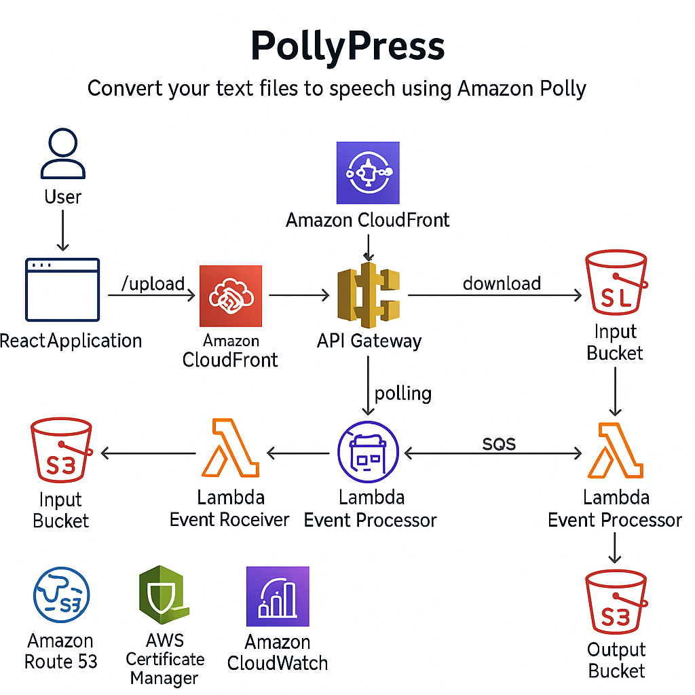

# PollyPress

Convert your text documents to speech using Amazon Polly.

## Overview

PollyPress is a simple, automated workflow that converts uploaded `.txt` files into spoken audio using **Amazon Polly**. Users upload a text file from a React frontend, and PollyPress returns a clean audio file they can listen to or download.

## Tech Stack

### Frontend
- **React** + **TypeScript** with **Vite**
- **Tailwind CSS v4** for styling
- **React Dropzone** for drag-and-drop file uploads
- Deployed to **S3 + CloudFront**

### Backend (AWS)
- **AWS CDK** (TypeScript) for infrastructure as code
- **Amazon S3** - Storage for input text files and output audio files
- **AWS Lambda** - Processing and API endpoints
- **Amazon Polly** - Text-to-speech synthesis
- **API Gateway** - RESTful API for frontend
- **CloudFront** - CDN for frontend hosting

## Architecture

### Architecture Diagram



### Stack Architecture

**Certificate Stacks (us-east-1 for frontend, regional for backend):**
- Frontend ACM certificate in us-east-1 (CloudFront requirement)
- Backend ACM certificate in deployment region (API Gateway requirement)
- DNS validation via Route 53
- Separate certificates for frontend and backend subdomains

**Backend Stack:**
- **S3 Buckets:**
  - Input bucket with 7-day lifecycle policy
  - Output bucket with 30-day lifecycle policy
  - CORS configured for direct uploads
- **Lambda Functions:**
  - Upload Handler - Generates presigned URLs for uploads
  - Download Handler - Generates presigned URLs for downloads
  - Event Receiver - Processes S3 events and queues messages
  - Event Processor - Synthesizes speech with Polly
- **SQS Queue:**
  - Processing queue with dead-letter queue
  - Batch processing for efficiency
- **API Gateway:**
  - `/upload` (POST) - Request presigned upload URL
  - `/download` (GET) - Request presigned download URL
  - `/status` (GET) - Health check endpoint
  - CloudWatch logging enabled
- **IAM Roles:**
  - Lambda execution roles
  - S3 read/write permissions
  - Polly synthesize speech permissions
  - CloudWatch Logs role for API Gateway

**Frontend Stack:**
- S3 bucket for static hosting
- CloudFront distribution with Origin Access Control (OAC)
- Automated deployment from `frontend/dist/`
- Custom domain with ACM certificate
- Route 53 alias record for custom domain

## Setup

### Prerequisites
- Node.js 22.x
- AWS CLI configured with profile `promie`
- AWS CDK CLI installed globally

### Installation

1. **Clone and install dependencies:**
   ```bash
   npm install
   cd frontend && npm install
   ```

2. **Configure environment variables:**
   Create a `.env` file in the root:
   ```
   CDK_DEPLOY_ACCOUNT=<your-aws-account-id>
   CDK_DEPLOY_REGION=ap-southeast-2
   APP_NAME=PollyPress
   STAGE=staging
   DOMAIN_NAME=yourdomain.com
   FRONTEND_SUBDOMAIN=pollypress
   BACKEND_SUBDOMAIN=api.pollypress
   ```

3. **Bootstrap CDK (first time only):**

   Bootstrap your primary region:
   ```bash
   AWS_PROFILE=promie npx cdk bootstrap aws://<account-id>/ap-southeast-2
   ```

   If using custom domains, also bootstrap us-east-1 (required for CloudFront certificates):
   ```bash
   AWS_PROFILE=promie npx cdk bootstrap aws://<account-id>/us-east-1
   ```

## Development

### Run Frontend Locally
```bash
npm run dev
```

### Build Frontend
```bash
cd frontend && npm run build
```

### Build CDK
```bash
npm run build
```

### Deploy Infrastructure Only
```bash
npm run deploy:infra
```

### Deploy Everything (Frontend + Backend)
```bash
npm run deploy
```

## Deployment

The deployment process:

1. **Build frontend** - Compiles React app to `frontend/dist/`
2. **Build CDK** - Compiles TypeScript infrastructure code
3. **Deploy Backend Stack** - Creates S3, Lambda, API Gateway
4. **Deploy Frontend Stack** - Uploads frontend to S3, creates CloudFront distribution

First deployment takes ~5-10 minutes due to CloudFront provisioning.

### Stack Outputs

After deployment, you'll see:

**Frontend Certificate Stack (if custom domain configured):**
- `CertificateArn` - ACM certificate ARN in us-east-1

**Backend Certificate Stack (if custom domain configured):**
- `CertificateArn` - ACM certificate ARN in deployment region

**Backend Stack:**
- `ApiUrl` - API Gateway endpoint or custom domain (e.g., `https://api.yourdomain.com`)
- `InputBucket` - S3 input bucket name
- `OutputBucket` - S3 output bucket name
- `CustomDomain` - API custom domain (if configured)

**Frontend Stack:**
- `FrontendUrl` - Custom domain or CloudFront URL (e.g., `https://pollypress.yourdomain.com`)
- `CloudFrontUrl` - CloudFront distribution URL
- `CustomDomain` - Frontend custom domain (if configured)
- `FrontendBucket` - S3 bucket name
